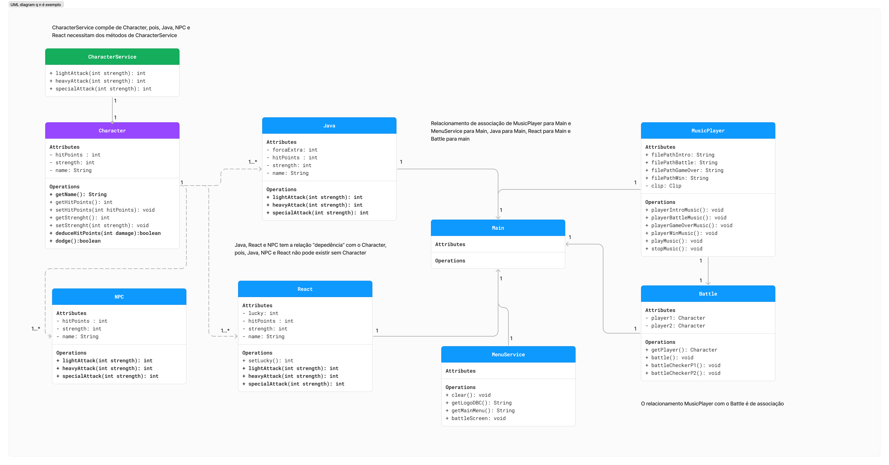
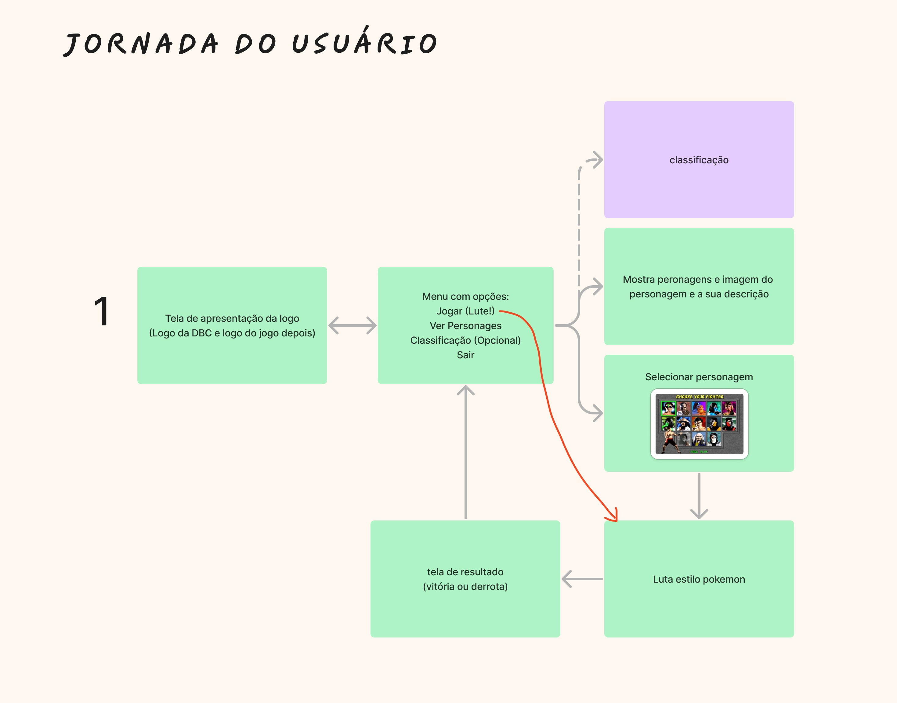

<div align="center">


# Front vs Back - The Game Terminal 🕹️


Projeto de criação de um jogo, para a Task 05 do **Vem Ser - DBC**
</div>

## Funcionalidades ⚙️

- Iniciar jogo
- Sistema de batalha com escolha de ataque
- Sistema de esquivas

>O jogo tem insipiração nos jogos clássicos de luta, como Mortal Kombat e Pokémon, misturando elementos distintos entre eles.
> Nesse jogo é possível o jogador escolher seu combatente, selecionar seus ataques e experiênciar os elementos de cada classe, como sorte, força e etc. 




## Jornada do Jogo

- Inicalização do jogo
- Escolha de personagem
- Inicio da luta
- Escolha dos ataques e defesas
- Finalização da luta e mensagem do resultado



## Rodando Localmente 💻

Clone o projeto

```bash
git clone https://github.com/RicksonPassos/vs14-back
```

Entre no diretório do projeto

```bash
cd ./01-java/src/task03
```

Compile as classes 


```bash
javac -d out Main.java entities/*.java
```

Execute o programa 
```bash
# Entre no diretório
cd out 
# Execute o programa
java task03.Main 
```

## Autores

- [@Mateus-de-Morais-Barros](https://github.com/Mateus-de-Morais-Barros)
- [@luizgpolido](https://www.github.com/luizgpolido)
- [@RicksonPassos](https://github.com/RicksonPassos)
- [@gessicafontes](https://github.com/gessicafontes)

## Referência

- [text to ascii art](https://patorjk.com/software/taag/)
- [img to ascii art](https://manytools.org/hacker-tools/convert-images-to-ascii-art/go/)


