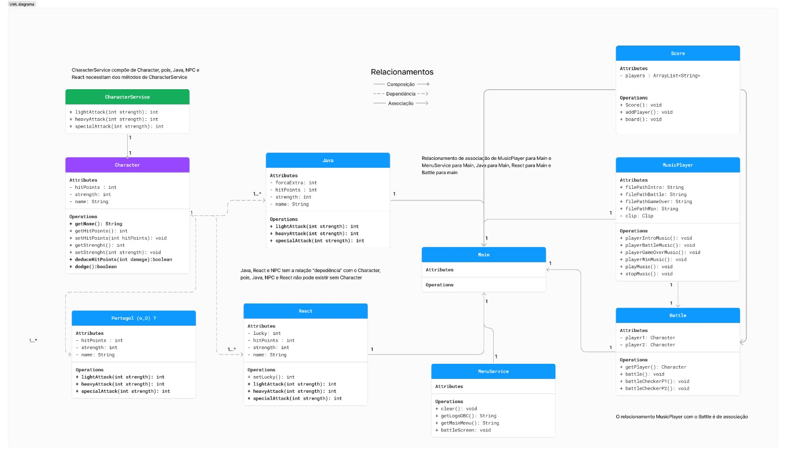
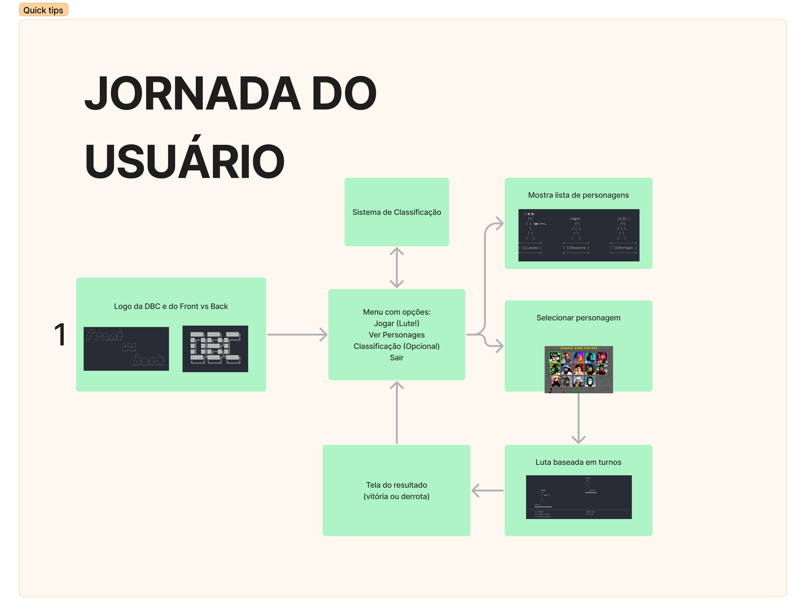

<div align="center">


# Front vs Back - The Terminal Game 🕹️


Projeto de criação de um jogo, para a Task 05 do **Vem Ser - DBC**
</div>

## Funcionalidades ⚙️

- Iniciar jogo
- Sistema de batalha com escolha de ataque
- Sistema de esquivas
- Criação de novos personagens - Etapa II
- Tratamento de erros - Etapa II
- Aprimoramento da UI - Etapa II
- Criação do score - Etapa II

>O jogo tem insipiração nos jogos clássicos de luta, como Mortal Kombat e Pokémon, misturando elementos distintos entre eles.
> Nesse jogo é possível o jogador escolher seu combatente, selecionar seus ataques e experiênciar os elementos de cada classe, como sorte, força e etc. 



## Jornada do Jogo

- Inicalização do jogo
- Opção de ver classificação
- Escolha de personagem
- Inicio da luta
- Escolha dos ataques e defesas
- Finalização da luta e mensagem do resultado




## Links externos
- [Figma (Construção do Diagrama e jornada do usuário)](https://www.figma.com/board/i6uQXNUFzZTE1JptWybVXd/Task-05---Front-Vs-Back?node-id=11-915&t=Q6HqUJTUV6ztv0Qt-0)
- [Backlog/Quadro Kanban](https://github.com/users/luizgpolido/projects/2/views/1)

## Rodando Localmente 💻

Clone o projeto

```bash
git clone https://github.com/luizgpolido/vs14-back
```

Entre no diretório do projeto

```bash
cd ./01-java/Task-05/src
```

Compile as classes 


```bash
# compile as classes
javac -d out Main.java entities/*.java services/*.java
# copie os arquivos
cp -r resources out/src/resources
```

Entre no diretório
```bash
cd out
```
Execute o programa 
```bash
java Main
```

## Autores

- [@Mateus-de-Morais-Barros](https://github.com/Mateus-de-Morais-Barros)
- [@luizgpolido](https://www.github.com/luizgpolido)
- [@RicksonPassos](https://github.com/RicksonPassos)
- [@gessicafontes](https://github.com/gessicafontes)

## Referência

- [text to ascii](https://patorjk.com/software/taag/)
- [img to ascii art](https://manytools.org/hacker-tools/convert-images-to-ascii-art/go/)
- [Como reproduzir som](https://stackoverflow.com/questions/32347274/how-to-play-record-sound-on-from-a-javax-sound-sampled-line)

